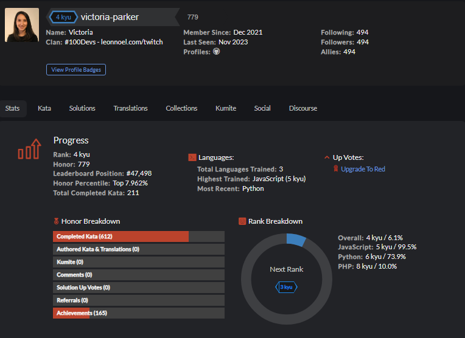

# CodeWars Challenges
This repository is filled with codewars challenges (katas). Currently Ranked #227984 on the global leaderboard, Completed over 70+ challenges and pushed at least 5 solutions every week.

**Link to my codewars profile:** https://www.codewars.com/users/victoria-parker

## How It's Made:

**Tech used:** JavaScript

Everyday, the first thing I do is solve a Codewar. We can say I have codewars for breakfast!

## Optimizations

I consistently refactor and optimize my code, sometimes for efficiency, and sometimes for readability. I love to watch how other people solved them to learn from them so then I include other ways to do it in my array of knowledge.

## Lessons Learned:

I learned that to tackle this endless supply of challenges, consistency is key. Every day is important to try to solve one. If I am not being able to solve the challenge I am facing, it's okay, as long as I learn from it and put it in my stack of things to review over the next few days until I fully understand it. After that, it will be one more of the things I know how to do.

